# Qwen3-ASR + HY-MT1.5 Migration Plan

## Scope And Defaults

- Replace ASR backend in [c:/Users/leoli/Desktop/Code/GenerateChineseSubtitleFromJapaneseVideo/speech_extract.py](c:/Users/leoli/Desktop/Code/GenerateChineseSubtitleFromJapaneseVideo/speech_extract.py) with **Qwen3-ASR-1.7B** (default).
- Replace translation backend with **HY-MT1.5-1.8B** (default), plus optional advanced switch for `HY-MT1.5-7B`.
- Add long-video processing architecture for videos around 30+ minutes using chunked processing.
- Make **chunk size user-configurable** in GUI and CLI (seconds), with safe defaults.
- Keep current output contract unchanged: bilingual SRT generation and existing burn flow in [c:/Users/leoli/Desktop/Code/GenerateChineseSubtitleFromJapaneseVideo/write_sutitle.py](c:/Users/leoli/Desktop/Code/GenerateChineseSubtitleFromJapaneseVideo/write_sutitle.py).

## Target Architecture

```mermaid
flowchart LR
    inputVideo[InputVideo] --> extractAudio[FFmpegExtract16kMono]
    extractAudio --> chunkManager[ChunkManager]
    chunkManager --> asrEngine[Qwen3ASREngine]
    asrEngine --> overlapHandler[OverlapAndLowConfidenceHandler]
    overlapHandler --> segments[TimestampedJapaneseSegments]
    segments --> glossaryMemory[GlossaryAndTranslationMemory]
    glossaryMemory --> mtEngine[HYMT15Engine]
    mtEngine --> bilingualBuilder[BilingualSRTWriter]
    bilingualBuilder --> checkpointStore[ChunkCheckpointStore]
    checkpointStore --> srtOut[BilingualSRTFile]
    srtOut --> burnStep[FFmpegBurnChineseOnly]
    burnStep --> outputVideo[OutputVideoWithHardsubs]
```

## Implementation Steps

- Introduce model-provider abstraction in [c:/Users/leoli/Desktop/Code/GenerateChineseSubtitleFromJapaneseVideo/speech_extract.py](c:/Users/leoli/Desktop/Code/GenerateChineseSubtitleFromJapaneseVideo/speech_extract.py):
  - `ASREngine` wrapper for Qwen3-ASR inference returning normalized segment dicts (`start`, `end`, `text`, optional `confidence`).
  - `TranslationEngine` wrapper for HY-MT1.5 generation with JA->ZH prompt template and deterministic decode defaults.
  - Keep `process_video()`/`process_video_to_srt()` signatures stable; add optional chunk settings args with backward-compatible defaults.
- Add a chunk manager in [c:/Users/leoli/Desktop/Code/GenerateChineseSubtitleFromJapaneseVideo/speech_extract.py](c:/Users/leoli/Desktop/Code/GenerateChineseSubtitleFromJapaneseVideo/speech_extract.py):
  - Split audio into chunks using user input `chunk_size_seconds` (default 120s, allowed range 30-600s).
  - Add overlap window (default 1.5s) to reduce word clipping at boundaries.
  - Convert chunk-local timestamps back to global video timeline.
  - Deduplicate/merge boundary subtitles across neighboring chunks.
- Add robust runtime/device controls:
  - Prefer CUDA with automatic fallback to CPU for load failures.
  - Explicit dtype/device map handling for model loading.
  - Add startup logs for selected model IDs and effective device.
- Add quality controls for difficult speech in [c:/Users/leoli/Desktop/Code/GenerateChineseSubtitleFromJapaneseVideo/speech_extract.py](c:/Users/leoli/Desktop/Code/GenerateChineseSubtitleFromJapaneseVideo/speech_extract.py):
  - Detect likely overlap/low-confidence segments and mark for second-pass ASR.
  - Re-run only flagged segments with stricter decoding settings (targeted reprocess, not full rerun).
  - Keep metadata for quality flags in intermediate files (not in final SRT output).
- Add translation consistency layer in [c:/Users/leoli/Desktop/Code/GenerateChineseSubtitleFromJapaneseVideo/speech_extract.py](c:/Users/leoli/Desktop/Code/GenerateChineseSubtitleFromJapaneseVideo/speech_extract.py):
  - User glossary file (names/special terms) loaded at startup.
  - Translation memory cache to keep phrase-level consistency across chunks.
  - Apply glossary post-processing guard to prevent name drift.
- Add checkpoint/resume mechanism:
  - Save chunk-level ASR and MT intermediate JSON in output directory.
  - On restart, skip completed chunks and continue from first failed/pending chunk.
- Update GUI model options in [c:/Users/leoli/Desktop/Code/GenerateChineseSubtitleFromJapaneseVideo/gui.py](c:/Users/leoli/Desktop/Code/GenerateChineseSubtitleFromJapaneseVideo/gui.py):
  - Replace Whisper dropdown with ASR/MT selectors and add `chunk_size_seconds` input.
  - Add validation and hints for chunk size (integer, 30-600).
  - Add advanced options panel for overlap seconds and quality mode (`fast`/`accurate`).
  - Update labels/help text from Whisper/googletrans wording to Qwen3-ASR/HY-MT1.5.
  - Keep worker-thread structure and existing thread-safe UI update helpers unchanged.
- Update CLI prompts in [c:/Users/leoli/Desktop/Code/GenerateChineseSubtitleFromJapaneseVideo/main.py](c:/Users/leoli/Desktop/Code/GenerateChineseSubtitleFromJapaneseVideo/main.py):
  - Add optional chunk-size input with same validation/defaults as GUI.
  - Add optional quality preset and glossary path prompt.
- Dependency and install updates:
  - Replace/remove `openai-whisper` and `googletrans` in [c:/Users/leoli/Desktop/Code/GenerateChineseSubtitleFromJapaneseVideo/requirements.txt](c:/Users/leoli/Desktop/Code/GenerateChineseSubtitleFromJapaneseVideo/requirements.txt).
  - Add required Hugging Face stack packages (Transformers/tokenizers/accelerate/safetensors/sentencepiece as needed by selected model repos).
  - Adjust checks in [c:/Users/leoli/Desktop/Code/GenerateChineseSubtitleFromJapaneseVideo/install.bat](c:/Users/leoli/Desktop/Code/GenerateChineseSubtitleFromJapaneseVideo/install.bat) and [c:/Users/leoli/Desktop/Code/GenerateChineseSubtitleFromJapaneseVideo/run.bat](c:/Users/leoli/Desktop/Code/GenerateChineseSubtitleFromJapaneseVideo/run.bat) to validate new imports.
- Documentation refresh in [c:/Users/leoli/Desktop/Code/GenerateChineseSubtitleFromJapaneseVideo/README.md](c:/Users/leoli/Desktop/Code/GenerateChineseSubtitleFromJapaneseVideo/README.md):
  - New model defaults, first-run model download behavior, recommended VRAM expectations.
  - Clarify optional `HY-MT1.5-7B` mode and when to use it.

## Compatibility And Risk Controls

- Keep subtitle file format unchanged (`JA` line then `ZH` line) so [c:/Users/leoli/Desktop/Code/GenerateChineseSubtitleFromJapaneseVideo/write_sutitle.py](c:/Users/leoli/Desktop/Code/GenerateChineseSubtitleFromJapaneseVideo/write_sutitle.py) continues to work.
- Ensure chunked processing preserves chronological order and no timestamp overlap regressions in final SRT.
- Implement guarded fallback behavior:
  - If 7B MT load fails (OOM), auto-fallback to 1.8B and log warning.
  - If ASR model load fails, return actionable error to GUI/CLI without crashing.
- For long runs, fail one chunk at a time instead of aborting whole pipeline; emit retryable error state.
- Add max-memory guardrails for large chunk sizes with warning and auto-cap suggestion.
- Preserve FFmpeg extraction settings initially; tune later only if Qwen3-ASR docs recommend different sample rate/channels.

## Validation Checklist (No Feature Drift)

- Generate bilingual SRT from a short JP video and confirm:
  - Segment timing format remains valid SRT.
  - JA and ZH lines are produced for each block.
- Generate subtitles for a 30+ minute video with chunking enabled and confirm:
  - User-selected chunk size is applied and logged.
  - End-to-end output contains continuous global timestamps.
  - Restarting mid-run resumes from checkpoint instead of starting over.
- Validate difficult-content behavior (overlap speech, names, accents, special terms):
  - Flagged low-confidence/overlap segments are reprocessed.
  - Glossary terms remain stable across chunks.
  - Known names are translated consistently in final SRT.
- Burn subtitles path still outputs Chinese-only hardsub video.
- GUI/CLI both run end-to-end with updated dependency checks.
- First-run model download and cached second-run behavior documented and observable in logs.

